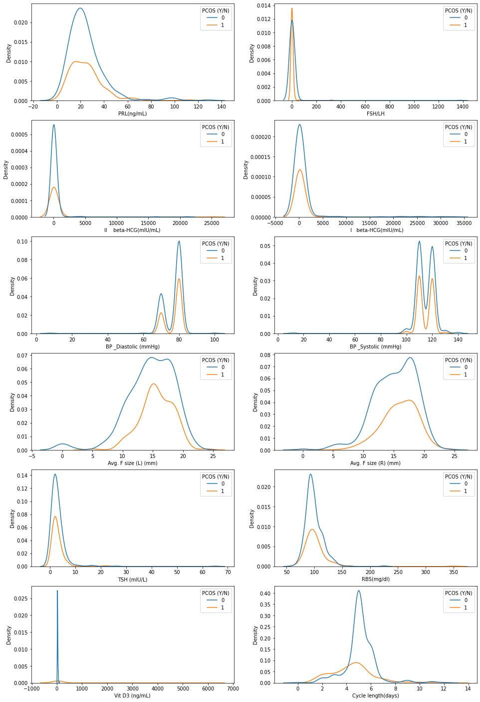
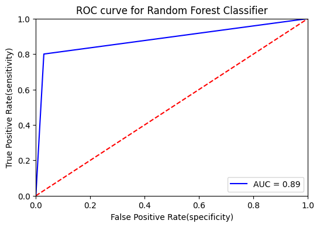

# PCOS-Detection-using-AI-ML
Hello, Basically this repository predict PCOS of the person from the given data. This operation is perfomed on the NVIDIA JETSON NANO Developer Kit. Basically I used Visualization, chi-square test, different classifiers, and models in this project. The Aim/target of the project is to predict the PCOS(Y/N) in the given dataset.
First as I told I used visulization and ploted the graphs, which shows PCOS(Y/N) data. I obseved that the graph of pateint who have PCOS is similar to person who dont have it. so here Visulization is not accuarate.
So, next I used statistics(Chi-aquare) test here. So using this we got the most important 30 features from given 45 features, so now its easy to predict the disease accurately. I used SelectKbest and Chi-squared here.
Now,i used cobination of columnTransformer and pipelinbe to transform the data to train the model for prediction. I applied ColumnTransformer to columns of pandas DataFrame. It allows different columns of the input to be transformed separately.

Here pipeline automates the machine learning workflow, so here it allows data to get tranformed and helps to corelate data into models we use and later I analysed it to achive output.

Now we have our transformed data,
So now we train our Machine Leaning Model: Here we used different type of classifiers like Random Forest Classifier, Support Vector Machine
(Linear and Redial), Logistic Regression, KNeighborsClassifier, Gaussian Naive Bayes. Also I used K-Folds cross-validator for evaluation of metrics.
so, now I defined this classifiers in the list name classifiers. After that I created model of this classifiers.

Now as I mentioned earlier that we perform the evaluation of the classifiers, so we take the 5 folds of the obsevations and find the mean value as well.
So, now I again perfomed Random forest classifier model using Confusion matrix and ROC Curve.
The confusion matrix is used to determine the performance of the classification models for our used datset.
So, through ROC Curve we test our target variable which is PCOS(Y/N) AND it gives us 
the area under the ROC curve gives an idea about the benefit of using the test(PCOS(Y/N) in this project. I used ROC Curve to find the best cutoff value to predict whether a new observation is a "failure" (0) or a "success" (1).
So, now we pedicted the Disease of a PCOS for a given dataset using Machine Learing(means using classification and Linear regression models).

Using Visulization we ploted the graph using seaborn and predicted PCOS for the given medical va;lues of individual person.

This Shows the ROC Curve which gives cutoff values for given obsevations for failure(0) and succes(1).

